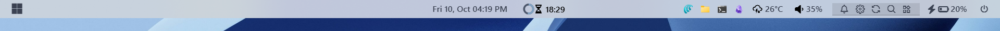
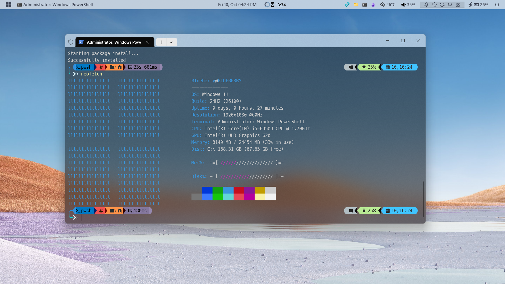

# myyasb dynamic (Dark & Light Mode)
Most of the yasb bar theme from yasb official repo does not have *light mode* which is such a drag! Cause I like the light theme in the day and dark mode in the night. This one has the full dark and light support. 

## Windows 11 Theme Light Mode

## Light Mode Desktop View

## Dark Mode

## Dark Mode Desktop View
